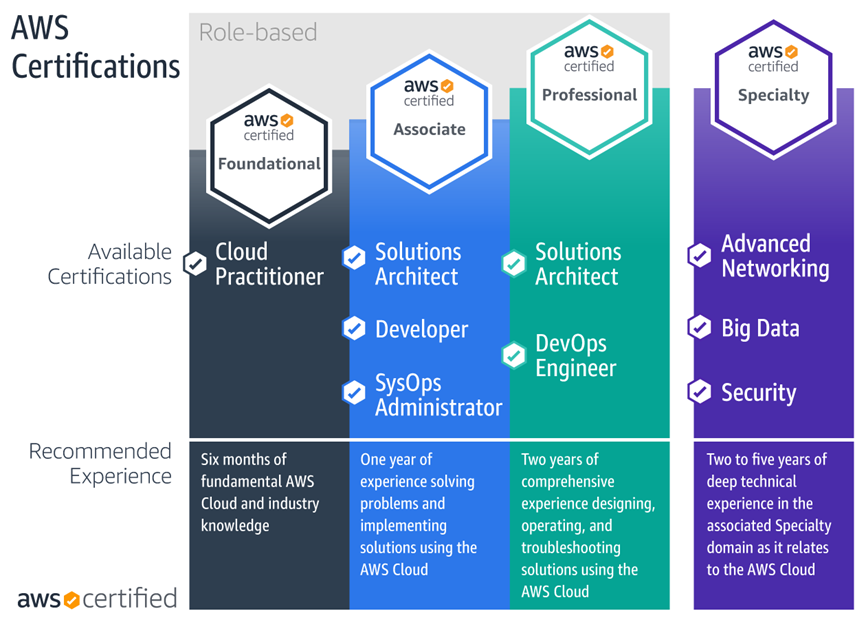
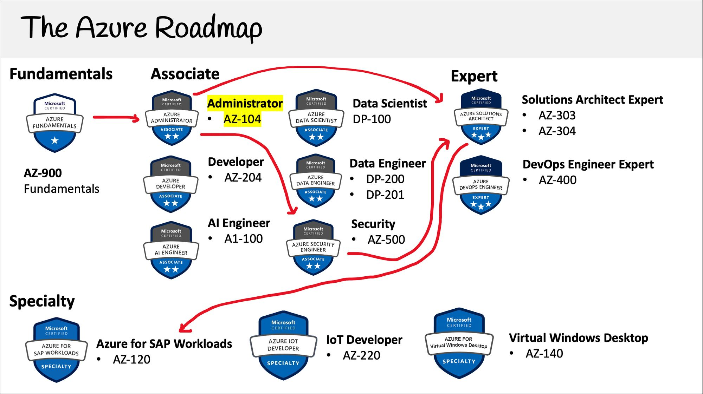

# Virtualize

### Certifications

- **Docker**
  
  - Docker Certified Associate (DCA)

- **Kubernetes**
  
  - Certified Kubernetes Administrator (CKA)

- **Cloud Service Providers**
  
  - **AWS**
  
  
  
  - **Azure**
  
  

### Youtube Videos

Subscribe ⬇️

- AWS Events

- freeCodeCamp.org

- Docker

- CNCF

- IBM Technology

- Open Infrastructure Foundation

- ...

### Books

- *Docker Deep Dive*

- *...*

### Well-known Projects

[firecracker](https://github.com/firecracker-microvm/firecracker) | Secure and fast microVMs for serverless computing. 

[qemu](https://github.com/qemu/qemu) ｜ A generic and open source machine emulator and virtualizer.

[kata](https://github.com/kata-containers/kata-containers) ｜ A standard implementation of lightweight Virtual Machines.

[dragonball](https://github.com/openanolis/dragonball-sandbox) ｜  A collection of Rust crates to help build custom Virtual Machine Monitors and hypervisors. The crates here are considered to be the downstream of [rust-vmm](https://github.com/rust-vmm).
